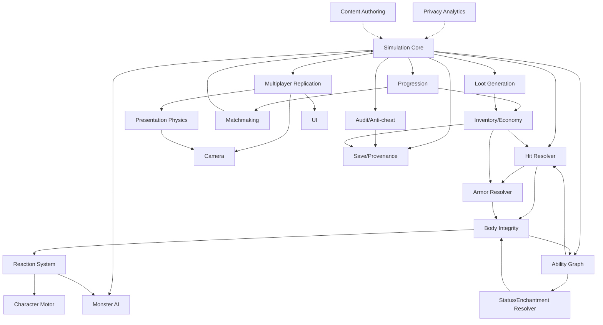

# GUMFALL — Technical Architecture

**Status:** DRAFT — Engine and networking platform: NOT SELECTED
**Label Policy:** VERIFIED | DERIVED | PROPOSED | ASSUMPTION | UNKNOWN | NOT PERFORMED
**Related:** [Data Contracts](DATA_CONTRACTS.md) · [Networking & Audit](NETWORKING_REPLICATION_AND_AUDIT.md) · [Content Authoring](CONTENT_AUTHORING.md) · [Performance Budgets](PERFORMANCE_BUDGETS.md) · [Index](../INDEX.md)

---

## 1. Architecture Philosophy

GUMFALL's architecture is governed by a single overriding principle:

> **The authoritative simulation decides all outcomes. The presentation communicates those outcomes.**

This separation exists because GelFlow combat is physical, localized, and deterministic. A hit either lands or it does not, based on server-validated geometry and timing. A limb either separates or it does not, based on body-region state on the authoritative server. The client may predict, animate, and display — but it must not decide.

This philosophy drives every boundary listed in this document.

### 1.1 Why Technology-Neutral Design

VERIFIED: No engine, language, or networking platform has been selected.

The architecture is specified in terms of contracts and responsibilities, not implementations, because:

- Engine selection depends on determinism achievability, physics control, and team expertise (see [ENGINE_EVALUATION_ADR](../production/ENGINE_EVALUATION_ADR.md)).
- Locking implementation now would prevent informed technology decisions.
- Data contracts can be validated independent of runtime.
- System boundaries remain stable even as implementation choices change.

Any compliant implementation must satisfy the contracts. Compliant implementations may differ internally.

### 1.2 Simulation Separation Principle

```
┌─────────────────────────────────────────────────────────────┐
│                    AUTHORITATIVE LAYER                       │
│  (Server-owned: deterministic, bit-exact, auditable)         │
│                                                             │
│  Simulation Core ── Hit Resolver ── Body Integrity           │
│       │                  │               │                  │
│  Ability Graph ── Armor Resolver ── Status Resolver          │
│       │                                  │                  │
│  Monster AI ── Reaction System ── Progression                │
│       │                                  │                  │
│  Loot Generation ── Inventory/Economy ── Save/Provenance     │
│       │                                  │                  │
│  Multiplayer Replication ── Matchmaking ── Audit/Anti-cheat  │
└─────────────────────────────────────────────────────────────┘
              │  Authority Boundary  │
              ▼                      ▼
┌─────────────────────────────────────────────────────────────┐
│                   PRESENTATION LAYER                         │
│  (Client-owned: visual, cosmetic, never decides outcomes)    │
│                                                             │
│  Presentation Physics ── Camera ── UI ── Analytics           │
│       │                    │        │                        │
│  Character Motor (predicted, reconciled from server)         │
└─────────────────────────────────────────────────────────────┘
```

---

## 2. All 21 Required System Boundaries

### Boundary 1 — Deterministic Simulation Core

**Responsibility:** Tick-based simulation loop. Advances game state by consuming validated inputs. Produces outcome events consumed by all other systems.

**Authority:** Server-authoritative. VERIFIED.

**Key Contracts:**
- Input: `ValidatedInput { player_id, tick, action_type, parameters }`
- Output: `SimulationEvent { tick, event_type, affected_entities, outcome_data }`
- Must produce identical output for identical input on any compliant host. VERIFIED requirement.

**Determinism Requirements:**
- Fixed-point arithmetic or verified floating-point mode (engine selection dependency). UNKNOWN: which approach until engine is selected.
- Tick rate: PROPOSED 60 Hz authoritative, PROPOSED 20 Hz network broadcast.
- No random number consumption outside the seeded RNG managed by this boundary.
- All seeded values (loot, tournament draws, dungeon geometry) flow from the simulation core's seed chain.

**Interfaces:**
- Exposes: `advance_tick(inputs[]) → SimulationEvent[]`
- Consumes: Character Motor commands (validated), Ability Graph triggers, AI decisions
- Publishes to: Hit Resolver, Body Integrity, Reaction System, Loot Generation, Audit

**Must not:** Branch on platform-native float behavior, consume wall-clock time, depend on presentation frame rate.

---

### Boundary 2 — Character Motor

**Responsibility:** Player character movement, locomotion state machine, jump, dodge, block pose, and physical positioning.

**Authority:** Client-predicted, server-reconciled. PROPOSED.

**Key Contracts:**
- Input: `MotorCommand { direction, speed, action_flags, timestamp }`
- Output: `MotorState { position, velocity, facing, locomotion_phase, predicted }`
- Server validates movement bounds and timing; rejects impossible trajectories.

**Determinism Requirements:**
- Server runs authoritative position. Client predicts locally, then reconciles on mismatch.
- Movement speed, dodge distance, and jump arc are server-defined constants. VERIFIED design requirement.

**Interfaces:**
- Exposes: `submit_command(MotorCommand)`, `get_reconciled_state() → MotorState`
- Consumes: Simulation Core tick, Ability Graph (ability-gated movement), Body Integrity (limb-loss movement penalties)
- Publishes to: Presentation Physics (visual smoothing), Camera (position tracking), Hit Resolver (attacker position)

---

### Boundary 3 — Ability Graph

**Responsibility:** Defines, validates, and sequences player and monster abilities. Enforces timing, cooldowns, cost, and preconditions.

**Authority:** Server-authoritative definitions. VERIFIED.

**Key Contracts:**
- Schema: `Ability { id, name, class_req, lineage_req, cost, cooldown, preconditions[], effects[], cancel_window, commit_point }` (see [Data Contracts](DATA_CONTRACTS.md))
- Input: `AbilityRequest { caster_id, ability_id, target_data, tick }`
- Output: `AbilityResult { granted, denied_reason, effects_queued[] }`

**Determinism Requirements:**
- Cooldown tracking must be tick-count based, not time-based. VERIFIED.
- Cancel windows defined in ticks. Commit points defined in ticks.

**Interfaces:**
- Exposes: `request_ability(AbilityRequest) → AbilityResult`
- Consumes: Simulation Core tick, Progression (unlocked abilities), Status/Enchantment Resolver (ability modifiers)
- Publishes to: Hit Resolver (attack abilities), Presentation Physics (visual triggers), Audit (ability usage log)

---

### Boundary 4 — Hit Resolver

**Responsibility:** Determines whether an attack connects with a target body region, accounting for weapon geometry, attacker position, target position, and armor coverage.

**Authority:** Server-authoritative. VERIFIED.

**Key Contracts:**
- Input: `AttackContext { attacker_id, weapon_id, swing_vector, target_id, tick }`
- Output: `HitResult { hit, body_region_id, raw_damage, armor_id, penetration_result }`
- All contact geometry evaluated server-side. VERIFIED.

**Determinism Requirements:**
- Hitbox geometry defined in design data, not derived from visual mesh.
- Sweep tests use fixed-point or validated float arithmetic.

**Interfaces:**
- Exposes: `resolve_hit(AttackContext) → HitResult`
- Consumes: Character Motor (positions), Body Integrity (region geometry), Ability Graph (attack data)
- Publishes to: Armor Resolver, Body Integrity, Status/Enchantment Resolver, Audit

**Must not:** Use visual skinning mesh for collision. Visual deformation is cosmetic.

---

### Boundary 5 — Armor Resolver

**Responsibility:** Computes damage reduction, penetration, and regional armor state degradation given a hit result and the target's armor configuration.

**Authority:** Server-authoritative. VERIFIED.

**Key Contracts:**
- Input: `HitResult`, `ArmorState { region_id, material_id, coverage, durability }`
- Output: `ArmorResolution { damage_after_armor, armor_damage_taken, region_exposed }`
- Material matrix: damage_type × armor_material → modifier. VERIFIED design requirement.

**Interfaces:**
- Exposes: `resolve_armor(HitResult, ArmorState) → ArmorResolution`
- Consumes: Hit Resolver output, Inventory/Economy (equipped armor state), Material data
- Publishes to: Body Integrity, Status/Enchantment Resolver, Presentation Physics (armor crack visual)

---

### Boundary 6 — Body Integrity

**Responsibility:** Tracks per-region health, separation state, reattachment state, and fallback behavior for each body region of each entity.

**Authority:** Server-authoritative. VERIFIED.

**Key Contracts:**
- Schema: `BodyRegion { id, entity_id, region_type, current_integrity, max_integrity, separation_threshold, separated, reattached, prosthetic_id }` (see [Data Contracts](DATA_CONTRACTS.md))
- Input: `ArmorResolution` → damage applied to region
- Output: `IntegrityEvent { region_id, new_state, separation_triggered, fallback_activated }`

**Determinism Requirements:**
- Separation threshold comparison must be deterministic (integer or fixed-point). VERIFIED.
- Reattachment requires matching region type and proximity check (server-validated).

**Interfaces:**
- Exposes: `apply_damage(region_id, ArmorResolution)`, `attempt_reattachment(region_id, source_entity)`
- Consumes: Armor Resolver output, Anatomy data (region configuration per lineage)
- Publishes to: Reaction System, Ability Graph (fallback abilities unlock), Presentation Physics, Monster AI, Audit

---

### Boundary 7 — Status / Enchantment Resolver

**Responsibility:** Applies, stacks, decays, and resolves status effects and enchantment interactions. Manages Ward resistance checks.

**Authority:** Server-authoritative. VERIFIED.

**Key Contracts:**
- Schema: `Enchantment { id, category, pressure_type, magnitude, duration_ticks, stack_behavior }` (see [Data Contracts](DATA_CONTRACTS.md))
- Schema: `Ward { id, resistance_type, threshold, decay_rate }`
- Input: `StatusApplication { source_id, target_id, enchantment_id, tick }`
- Output: `StatusResolution { applied, resisted, stacked, overmatch_triggered }`
- Malady resolution (Omnislayer, Ruin, Affliction, Finality) handled here. VERIFIED.

**Interfaces:**
- Exposes: `apply_status(StatusApplication) → StatusResolution`, `tick_statuses(entity_id, tick)`
- Consumes: Hit Resolver, Ability Graph, Armor Resolver (Ward data from equipped items)
- Publishes to: Body Integrity (status-driven damage), Reaction System, Presentation Physics, Audit

---

### Boundary 8 — Reaction System

**Responsibility:** Triggers and sequences entity reactions: flinch, stagger, knockback, ragdoll cue, surrender, morale break.

**Authority:** Server-authoritative triggers. Presentation-side animation blending. PROPOSED.

**Key Contracts:**
- Input: `ReactionTrigger { entity_id, trigger_type, magnitude, source_direction }`
- Output: `ReactionEvent { entity_id, reaction_type, duration_ticks, movement_override }`

**Interfaces:**
- Exposes: `trigger_reaction(ReactionTrigger) → ReactionEvent`
- Consumes: Body Integrity (separation events), Status Resolver (stun/freeze), Hit Resolver (knockback force)
- Publishes to: Character Motor (movement lockout), Monster AI (morale update), Presentation Physics (ragdoll hint)

---

### Boundary 9 — Monster AI

**Responsibility:** Drives monster decision-making: target selection, attack sequencing, morale, group coordination, surrender evaluation, and awareness.

**Authority:** Server-authoritative decisions. VERIFIED.

**Key Contracts:**
- Input: `AIContext { entity_id, perception_state, body_integrity, morale, group_state }`
- Output: `AIDecision { action_type, target_id, ability_id, movement_target }`
- Anti-repetition: consecutive identical decisions require varied timing. VERIFIED design requirement.

**Interfaces:**
- Exposes: `evaluate(AIContext) → AIDecision`
- Consumes: Simulation Core tick, Body Integrity (own state), Reaction System (morale events), Encounter data
- Publishes to: Ability Graph (monster ability requests), Character Motor (monster movement), Audit

---

### Boundary 10 — Progression

**Responsibility:** Tracks XP, level, era, ability unlock state, and level-gate enforcement.

**Authority:** Server-authoritative. VERIFIED.

**Key Contracts:**
- XP formula L1–50: `round(300 × L^1.8)`. VERIFIED.
- XP formula L51–70: `XP(50) × 1.18^(L-50)`. VERIFIED.
- XP formula L71–80: `XP(70) × 1.35^(L-70)`. VERIFIED.
- XP formula L81–90: `XP(80) × 1.65^(L-80)`. VERIFIED.
- XP formula L91–99: `XP(90) × 2.20^(L-90)`. VERIFIED.
- Level gates: `LevelGate { level, required_trials[], required_lineage_milestones[] }` (see [Data Contracts](DATA_CONTRACTS.md))
- Input: `XPAward { entity_id, source_type, amount, tick }`
- Output: `ProgressionEvent { level_up, new_level, era_change, gates_checked }`

**Interfaces:**
- Exposes: `award_xp(XPAward)`, `check_gate(entity_id, level) → GateResult`
- Consumes: Simulation Core (combat outcomes), Quest system, Trial system
- Publishes to: Ability Graph (unlocks), Inventory/Economy (material access), Matchmaking (ranked tier), Audit

---

### Boundary 11 — Inventory / Economy

**Responsibility:** Tracks owned items, equipped items, currency, and crafting state. Enforces economy rules.

**Authority:** Server-authoritative. VERIFIED.

**Key Contracts:**
- Currency hierarchy: Tin Bit → Copper Link → Bronze Mark → Silver Shield → Electrum Sun → Gold Crown → Platinum Seal → Iridium Star → Aetherium Prism. VERIFIED.
- Input: `EconomyTransaction { entity_id, transaction_type, item_ids[], currency_delta }`
- Output: `TransactionResult { committed, rejected_reason, new_balances }`

**Interfaces:**
- Exposes: `transact(EconomyTransaction) → TransactionResult`, `get_loadout(entity_id) → Loadout`
- Consumes: Loot Generation (item grants), Progression (material access gates), PvP normalization data
- Publishes to: Armor Resolver (equipped armor), Hit Resolver (equipped weapon), Audit (all transactions), Save/Provenance

---

### Boundary 12 — Loot Generation

**Responsibility:** Generates item drops, ensures source traceability, and enforces protected drop configurations.

**Authority:** Server-authoritative, seeded deterministic. VERIFIED.

**Key Contracts:**
- Schema: `LootSource { id, monster_id, faction, drop_table_id, seed_contribution }` (see [Data Contracts](DATA_CONTRACTS.md))
- Schema: `Provenance { item_instance_id, source_type, source_id, tick, world_seed_snapshot }`
- All drops must produce a `Provenance` record. VERIFIED design requirement.
- Protected drop configurations must not appear in public data files. VERIFIED.

**Interfaces:**
- Exposes: `generate_loot(LootSource, seed) → LootResult[]`
- Consumes: Simulation Core seed chain, Monster data, Progression (material access), Inventory/Economy
- Publishes to: Inventory/Economy (item grant), Save/Provenance, Audit

---

### Boundary 13 — Content Authoring

**Responsibility:** Pipeline and validation layer ensuring content conforms to schemas before entering the game. Not a runtime system — a production system.

**Authority:** Pre-production gating system. VERIFIED design requirement.

**Key Contracts:**
- All content files must validate against canonical schemas before import. VERIFIED.
- Private content (secret areas, protected loot) validated in private pipeline only. VERIFIED.
- See [Content Authoring](CONTENT_AUTHORING.md) for full pipeline specification.

**Interfaces:**
- Exposes: `validate(content_file, schema_id) → ValidationResult`
- Publishes to: Simulation Core (validated data), Audit (content version log)

---

### Boundary 14 — Save / Provenance

**Responsibility:** Serializes and deserializes authoritative game state with full provenance chain. Manages cloud sync, migration, and integrity verification.

**Authority:** Server-authoritative writes. VERIFIED.

**Key Contracts:**
- Schema: `SaveRecord { entity_id, version, tick, state_snapshot, provenance_chain[], integrity_hash }`
- Migration: `migrate(SaveRecord, target_version) → SaveRecord`. PROPOSED: forward-only migration.
- Integrity hash covers state snapshot and provenance chain. PROPOSED.

**Interfaces:**
- Exposes: `save(entity_id)`, `load(entity_id) → SaveRecord`, `migrate(SaveRecord, version)`
- Consumes: All authoritative systems (state snapshots), Audit (provenance events)
- Publishes to: Progression, Inventory/Economy (restored state)

---

### Boundary 15 — Multiplayer Replication

**Responsibility:** Propagates authoritative state changes from server to clients at appropriate priorities, and delivers client inputs to server.

**Authority:** Server-authoritative source. PROPOSED: entity interpolation + reconciliation on client.

**Key Contracts:**
- Replication priority: Body Integrity state > positions > ability states > inventory > cosmetic state
- Input delivery: `ClientInput { player_id, inputs[], client_tick }` → server tick mapping
- State broadcast: `ReplicationPacket { server_tick, entity_deltas[], priority_class }`

**Interfaces:**
- Exposes: `submit_input(ClientInput)`, `receive_state_update(ReplicationPacket)`
- Consumes: Simulation Core outputs (all systems), Character Motor (predicted state)
- Publishes to: Presentation Physics, Camera, UI, Audit (network events)

**Never replicates:** Exact simulation seed values, protected loot configurations, anti-cheat thresholds. VERIFIED.

---

### Boundary 16 — Matchmaking

**Responsibility:** Forms matches, assigns arenas, seeds tournaments, and enforces ranked division brackets.

**Authority:** Server-authoritative. VERIFIED.

**Key Contracts:**
- Ranked divisions: Copper (10–19), Bronze (20–29), Iron (30–39), Steel (40–49), Heroic (50–59), Mithril (60–69), Legendary (70–80), Mythic (81–90), Apex (91–100), Unbound (reserved). VERIFIED.
- Tournament seeds: deterministic. VERIFIED design requirement.
- PvP normalization scalars applied at match entry. VERIFIED.

**Interfaces:**
- Exposes: `request_match(player_id, mode)`, `form_match(candidates[]) → MatchAssignment`
- Consumes: Progression (level/division data), Arena definitions, Tournament schemas
- Publishes to: Simulation Core (match initialization), Audit (match formation log)

---

### Boundary 17 — Audit / Anti-Cheat

**Responsibility:** Records authoritative events for integrity verification, detects anomalous patterns, and enforces exploit quarantine.

**Authority:** Server-authoritative. VERIFIED.

**Key Contracts:**
- All simulation events generate an audit record. VERIFIED.
- Audit records: `AuditEvent { tick, event_type, entity_ids[], outcome_hash, session_id }`
- Anti-cheat signatures are not committed to public repositories. VERIFIED.
- Exploit quarantine: anomalous entity flagged, progression paused pending review. PROPOSED.

**Privacy:**
- Audit logs contain gameplay events only. VERIFIED.
- Session content (chat, private messages) never logged in gameplay audit. VERIFIED.
- Exact movement paths not retained in long-term logs (aggregates only). VERIFIED.
- User rights: users may request audit record summary for their own account. PROPOSED.

**Interfaces:**
- Exposes: `log_event(AuditEvent)`, `flag_entity(entity_id, reason)`, `query_history(entity_id, range)`
- Consumes: All authoritative system outputs
- Publishes to: Save/Provenance (integrity chain), Matchmaking (ban enforcement)

---

### Boundary 18 — Presentation Physics

**Responsibility:** Drives visual-only physical behavior: mesh deformation, gummy stretch, ragdoll, particle effects. Never decides gameplay outcomes.

**Authority:** Client-only. VERIFIED.

**Key Contracts:**
- Input: `PresentationHint { event_type, affected_regions[], magnitude, direction }` from authoritative systems
- Presentation physics may lag or approximate — it must not gate gameplay events. VERIFIED.
- Reduced body-separation presentation must be available for accessibility. VERIFIED.

**Interfaces:**
- Exposes: `apply_hint(PresentationHint)`
- Consumes: Body Integrity events (separation triggers), Hit Resolver results (impact direction), Reaction System events

---

### Boundary 19 — Camera

**Responsibility:** Third-person camera tracking, combat focus, cinematic framing. Pure presentation.

**Authority:** Client-only. VERIFIED.

**Key Contracts:**
- Reduced camera motion mode must be available. VERIFIED accessibility requirement.
- Camera does not influence hit detection or ability targeting (those are server-authoritative).

**Interfaces:**
- Consumes: Character Motor state, Ability Graph (ability camera cues), Reaction System (impact response cues)

---

### Boundary 20 — UI

**Responsibility:** Displays game state communicated from server. Color-independent status indicators. Scalable layout.

**Authority:** Client-only, display only. VERIFIED.

**Key Contracts:**
- Status conditions must be communicated without relying on color alone. VERIFIED accessibility requirement.
- Scalable UI elements. VERIFIED accessibility requirement.
- Screen-reader planning required. VERIFIED accessibility requirement.
- UI never makes gameplay decisions.

**Interfaces:**
- Consumes: All system outputs (via replication), Accessibility settings

---

### Boundary 21 — Privacy-Aware Analytics

**Responsibility:** Collects aggregated behavioral signals to inform design decisions. Never collects personally identifying gameplay content.

**Authority:** Server-side aggregation. VERIFIED.

**What is NEVER collected:**
- Exact movement paths of individual players. VERIFIED.
- Session chat content. VERIFIED.
- Private messages. VERIFIED.
- Biometric or device-identifying signals beyond platform requirements. VERIFIED.
- Any data that could re-identify an anonymous session. VERIFIED.

**What MAY be collected (PROPOSED):**
- Aggregated class usage rates (not per-player).
- Death event region distribution (aggregated).
- Match duration distributions.
- Feature toggle usage rates (not per-player identity).

**Interfaces:**
- Consumes: Simulation Core (aggregate event counts), Matchmaking (match outcome aggregates)
- Publishes to: Internal analysis pipeline (never to public repositories)

---

## 3. Dependency Diagram



*Dashed arrows indicate pre-production data flow (content pipeline), not runtime calls.*

---

## 4. Data Flow: Attack Input to Outcome

The following traces a full attack from player input through all relevant boundaries:

```
1. Player presses attack input (client)
   └─► Character Motor: validates locomotion phase allows attack
       └─► Ability Graph: receives AbilityRequest, checks class/cooldown/cost
           └─► [GRANTED] → Simulation Core queues ability at current tick

2. Simulation Core advances tick
   └─► Hit Resolver: evaluates AttackContext (attacker position, weapon, swing vector, target)
       └─► [HIT] → HitResult { body_region_id=LEFT_ARM, raw_damage=42, armor_id=BRONZE_VAMBRACE }

3. Armor Resolver: receives HitResult + equipped ArmorState
   └─► Material matrix: SLICE vs BRONZE → modifier applied
       └─► ArmorResolution { damage_after_armor=28, armor_damage=6, region_exposed=false }

4. Status/Enchantment Resolver: checks weapon enchantments, target Ward state
   └─► [ENCHANTMENT: Sour Injury] pressure check vs Ward resistance
       └─► StatusResolution { applied=true, stacked=false }

5. Body Integrity: receives ArmorResolution
   └─► LEFT_ARM integrity: 45 → 17 (below separation_threshold=20)
       └─► IntegrityEvent { separation_triggered=true }

6. Reaction System: receives separation event
   └─► ReactionEvent { reaction_type=LIMB_LOSS_STAGGER, duration_ticks=18 }

7. Monster AI: receives morale update from Reaction System
   └─► [MORALE below surrender threshold?] → evaluate AIDecision

8. Loot Generation: if entity defeated → generate_loot(LootSource, seed)
   └─► Provenance record created

9. Progression: XP award generated from combat outcome
   └─► XPAward → level check → gate check

10. Audit: records all events from steps 2–9 with tick, outcome hashes

11. Multiplayer Replication: broadcasts state deltas to all clients
    └─► Presentation Physics: receives separation hint → plays limb separation animation
    └─► UI: updates body region indicator (color-independent)
    └─► Camera: receives impact cue
```

---

## 5. Server Authority Boundaries

| Domain | Server Owns | Client May Predict |
|---|---|---|
| Movement | Final position, speed validation | Local position (reconciled) |
| Attack timing | Hit registration, commit point | Input timing (buffered) |
| Hit detection | All contact geometry | None |
| Damage calculation | All damage values | None |
| Body Integrity | All region states | Cosmetic deformation |
| Loot generation | All drops, provenance | None |
| XP and leveling | All awards, level changes | None |
| Enchantment resolution | All status applications | None |
| PvP outcomes | All match results | None |
| Tournament seeds | All draw orders | None |
| Leaderboards | All rankings | None |
| Economy | All transactions | None |

---

## 6. Simulation Determinism Requirements

Determinism is required because:
- Replay systems must reproduce exact simulation outcomes.
- Audit trails rely on reproducible hashes.
- Tournament integrity depends on seed reproducibility.
- Anti-cheat anomaly detection compares observed vs. expected outcomes.

**What must be bit-exact:**
- All damage calculations. VERIFIED.
- All XP award calculations. VERIFIED.
- All separation threshold comparisons. VERIFIED.
- All RNG draws from the seeded chain. VERIFIED.
- All tournament and dungeon seed chains. VERIFIED.

**Implementation options (UNKNOWN until engine selected):**
- Fixed-point arithmetic for all simulation math.
- IEEE 754 doubles with strict compiler modes and no platform-native extended precision.
- Software-emulated float layer.

**What is explicitly NOT required to be deterministic:**
- Presentation physics (ragdoll, particle effects). VERIFIED.
- Camera behavior. VERIFIED.
- Audio timing. VERIFIED.

---

## 7. Technology Neutrality

No engine, language, or networking platform is selected. VERIFIED.

This document specifies contracts, not implementations. Any implementation stack must satisfy:

1. Ability to enforce server-authoritative simulation with client prediction.
2. Tick-based deterministic simulation loop.
3. Region-level body state tracking per entity.
4. Procedural mesh deformation capability (presentation layer).
5. Data-driven content loading with schema validation.
6. Platform coverage sufficient for target audiences. UNKNOWN: platforms not decided.

See [ENGINE_EVALUATION_ADR](../production/ENGINE_EVALUATION_ADR.md) for evaluation criteria and candidate analysis.

---

## 8. Integration Points Between Systems

| System A | System B | Integration Type | Data |
|---|---|---|---|
| Simulation Core | All authoritative systems | Tick broadcast | `SimulationEvent[]` |
| Hit Resolver | Armor Resolver | Sequential pipeline | `HitResult` |
| Armor Resolver | Body Integrity | Sequential pipeline | `ArmorResolution` |
| Body Integrity | Ability Graph | Event notification | `IntegrityEvent` (unlock fallbacks) |
| Body Integrity | Monster AI | Event notification | `IntegrityEvent` (morale) |
| Progression | Ability Graph | State query | Unlocked ability list |
| Progression | Matchmaking | State query | Level/division |
| Loot Generation | Inventory/Economy | Transaction | `LootResult[]` |
| All systems | Audit | One-way log | `AuditEvent` |
| All systems | Multiplayer Replication | State delta broadcast | `ReplicationPacket` |
| Content Authoring | Simulation Core | Pre-production data push | Validated content files |

---

## 9. Scalability Considerations

PROPOSED — not validated. No load testing has been performed (NOT PERFORMED).

- Simulation Core must support at minimum: solo, 2-player co-op, 8-player arena, 32-player Shattercrown. PROPOSED.
- Body Integrity state scales O(entities × regions). Maximum concurrent entities per zone: UNKNOWN.
- Monster AI group coordination must scale to encounter group sizes defined in content data.
- Matchmaking: horizontal scaling via independent match servers. PROPOSED.
- Audit log: append-only, distributed-friendly. PROPOSED.
- Loot Generation: stateless per-call, horizontally scalable. PROPOSED.

---

## 10. Security Boundaries Overview

- Anti-cheat signatures, detection thresholds, and quarantine triggers are NOT in public documentation. VERIFIED.
- Protected loot configurations are NOT in public data files. VERIFIED.
- All economy transactions validated server-side before commit. VERIFIED design requirement.
- Exploit quarantine system: PROPOSED — flags entity for review without immediate ban, preserves evidence. PROPOSED.
- Private infrastructure details not documented here. VERIFIED.
- Credentials never committed to repository. VERIFIED.

See [NETWORKING_REPLICATION_AND_AUDIT](NETWORKING_REPLICATION_AND_AUDIT.md) for full audit and anti-cheat design.

---

## 11. Privacy-Aware Analytics Design

See Boundary 21 above for what is never collected.

**Design principles:**
- Analytics data is aggregated before storage where possible. PROPOSED.
- No individual player tracking across sessions without explicit opt-in. PROPOSED.
- Retention period: UNKNOWN — must be determined by legal review before live operation. ASSUMPTION.
- User data rights: request, export, delete. PROPOSED.
- Analytics pipeline is separate from gameplay audit. VERIFIED design requirement.
- Analytics telemetry never includes session content, exact movement traces, or personally identifiable signals. VERIFIED.

---

*Last updated: 2026-08-02 | Branch: design/full-game-bible-20260802-223853*
*See [DECISION_LOG](../governance/DECISION_LOG.md) for open architecture decisions.*
